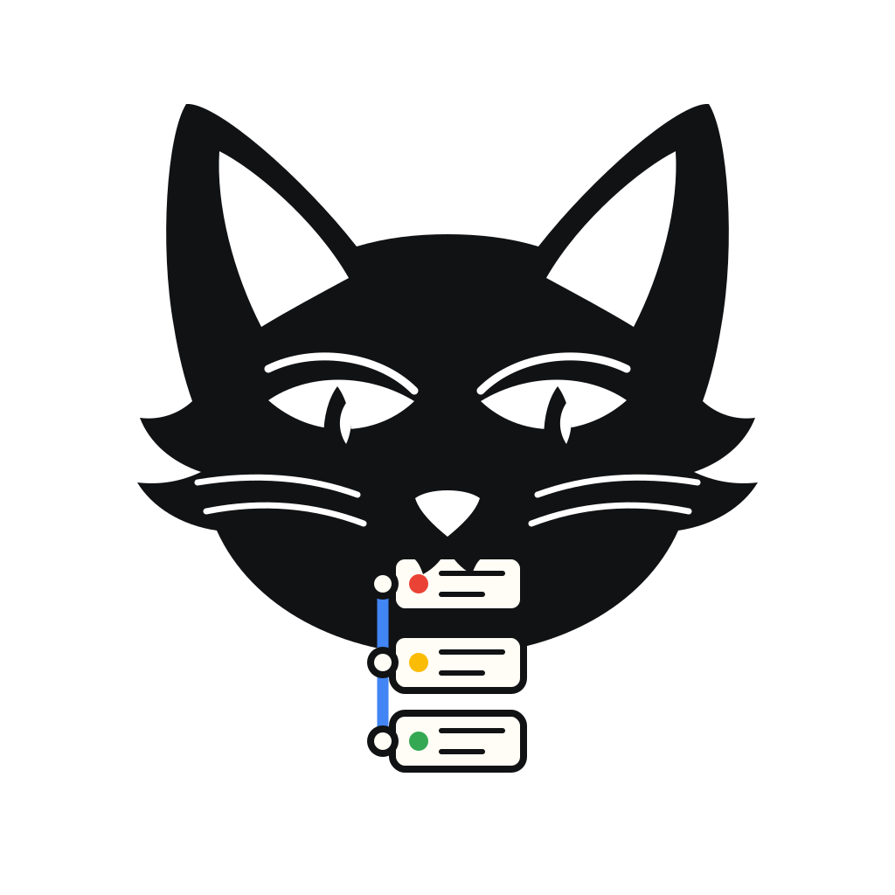

<!--
SPDX-FileCopyrightText: 2026 Blackcat Informatics® Inc. <paudley@blackcatinformatics.ca>
SPDX-License-Identifier: MIT OR Apache-2.0
-->
<p align="center">
  <a href="https://blackcatinformatics.ca/projects/gts">
    
  </a>
</p>

<h1 align="center">GTS — Graph Transport Substrate</h1>

<p align="center">
  <em>A single-file, content-addressed, append-only transport for RDF 1.2 graphs and the binaries they reference.</em>
</p>

<p align="center">
  <strong>A whole graph in a single, verifiable file.</strong>
</p>

<p align="center">
  <a href="https://github.com/Blackcat-Informatics/gmeow-gts/actions/workflows/ci.yml"></a>
  <a href="https://crates.io/crates/gmeow-gts"></a>
  <a href="https://pypi.org/project/gmeow-gts/"></a>
  <a href="https://www.npmjs.com/package/@blackcatinformatics/gmeow-gts"></a>
  <a href="https://doi.org/10.67342/umcdg7675h/v1"></a>
  <a href="./LICENSING.md"></a>
</p>

---

GTS encodes a graph as an **append-only log of CBOR frames**. The logical graph is the
*fold* (replay) of the log. Growth is an append; "deletion" is **suppression**, never a
physical removal; optimisation is a separate, explicitly lossy compaction. Concatenating
two valid GTS files (`cat`) yields a valid GTS file whose fold is the value-union of the
inputs.

GTS is ontology-independent. **GTS is the primary distribution method for GMEOW, but GTS does
not depend on GMEOW.** A conformant reader does not need GMEOW vocabulary, OWL reasoning,
domain specific rules, or agent-memory conventions to parse, verify, fold, or transport a GTS
file.

The package family is `gmeow-gts`; the format is GTS. The package name is intentionally
distinctive across ecosystems, while the CLI, import surface, and file extension remain the
short `gts` and `.gts` forms where ecosystem rules permit.

This repository holds **six interoperable full engines** (Rust, Python, Go, TypeScript,
Smalltalk/Pharo, Kotlin/JVM) that gate against one frozen, byte-exact conformance corpus and the
specification that defines them. It also publishes a Rust-backed **C ABI** (`libgts`) and thin
derived wrappers for C-compatible ecosystems; those wrappers consume the Rust engine through
`rust/capi/include/gts.h` and are not new wire-format engines or CLI parity columns.

- Project URL: <https://blackcatinformatics.ca/projects/gts>
- Project DOI: <https://doi.org/10.67342/umcdg7675h/v1>

## Table of contents

- [Why GTS?](#why-gts)
- [Use GTS without GMEOW](#use-gts-without-gmeow)
- [Narrow-waist architecture](#narrow-waist-architecture)
- [Applications](#applications)
- [Install](#install)
- [Quick start](#quick-start)
  - [Python](#python)
  - [Rust](#rust)
  - [Go](#go)
  - [TypeScript](#typescript)
  - [Smalltalk/Pharo](#smalltalkpharo)
  - [Kotlin/JVM](#kotlinjvm)
- [C ABI and ecosystem wrappers](#c-abi-and-ecosystem-wrappers)
- [Command-line interface](#command-line-interface)
- [Engine feature matrix](#engine-feature-matrix)
- [The file format in one minute](#the-file-format-in-one-minute)
- [Conformance corpus](#conformance-corpus)
- [Repository layout](#repository-layout)
- [Building from source](#building-from-source)
- [Versioning & releases](#versioning--releases)
- [Specification & docs](#specification--docs)
- [Contributing](#contributing)
- [License](#license)

## Why GTS?

Four properties define the format ([full spec](./docs/GTS-SPEC.md)):

1. **CBOR all the way down** (RFC 8949). One IETF-standardised binary encoding with native
   byte strings (no base64 tax), deterministic encoding (clean content hashes), and CBOR
   Sequences — concatenated items with no enclosing length, so append is cheap. A reader needs
   only a CBOR library.
2. **A durable transform catalog.** Each frame's payload carries a *stackable* chain of
   codecs from an open, long-lived catalog (`identity`, `gzip`, `zstd`, `zstd-rsyncable`,
   `cose-encrypt`, …) — separating *structure durability* (CBOR + this spec, forever) from
   *density and confidentiality* (swappable codecs).
3. **Integrity by construction.** Every frame carries an independent **BLAKE3 self-hash** and
   names its predecessor — a git-style content-addressed chain. Verification is parallel, a
   damaged frame is independently detectable, and the head id transitively commits to all
   history. Signatures and encryption (COSE, RFC 9052) are optional, layered, and algorithm-agile.
4. **Recursive composition (matryoshka).** A payload, once its transforms are reversed, is just
   bytes — and a GTS file is just bytes. So a payload MAY itself be a complete signed GTS,
   wrapped in any transform, riding inside an encrypted field with its own header and chain.

**Non-goals.** GTS is explicitly *not* a database, query engine, reasoner, or mutation
protocol. Random-access query, deep traversal, and SPARQL are the job of a transform target
(`.ttl`, `.nq`, DuckDB, SQLite, …), not of GTS. It is a *durable, self-describing
interchange container* — the narrow waist through which graphs and their referenced data travel.

## Use GTS without GMEOW

GMEOW is a primary downstream consumer and reference profile family for GTS artifacts. The
dependency direction is one-way: GMEOW rides on GTS; GTS does not require GMEOW.

A baseline reader needs the GTS wire-format rules, the codec catalog, and RDF term/fold
semantics. It does not need a GMEOW ontology checkout, GMEOW-specific vocabulary, music-domain
profile knowledge, or agent-memory conventions. Domain profiles can add validation rules above
the transport layer, but they do not change the core parse, verification, or fold path.

## Narrow-waist architecture

```text
Applications and profiles
generic graphs | files | evidence | images | media packages | GMEOW | agent memory
|
v
GTS narrow waist
CBOR Sequence segments
deterministic-CBOR headers and frames
BLAKE3 id/prev chains
transform catalog
deterministic fold
opaque-node degradation
|
v
Storage and transport
filesystem | HTTP range | object storage | artifact registries | message buses
```

GTS is the small stable waist. Profiles and applications sit above it; storage and distribution
systems sit below it. See [`docs/positioning.md`](./docs/positioning.md) for the full framing.

## Applications

GTS supports several use cases without making any of them the project frame:

- **Dataset and ontology distribution:** publish a verifiable graph package with the binary
  assets it names.
- **GMEOW distribution:** ship GMEOW ontology packages and profiles as GTS artifacts.
- **Archives and file manifests:** package directory trees with graph-native metadata and
  content-addressed blobs.
- **Evidence and custody chains:** append observations, signatures, and sealed payloads without
  rewriting prior history.
- **Local-first graph synchronization:** concatenate independently produced segments and fold
  the value-union.
- **Agent memory:** model belief revision with suppression frames while preserving the original
  signed history. See Python
  [`gts.examples.agent_memory`](./python/src/gts/examples/agent_memory.py) and Rust
  [`gmeow_gts::examples::agent_memory`](./rust/src/examples/agent_memory.rs).
- **Graph database interchange:** hand the folded graph state to N-Quads, SQLite, DuckDB, Parquet,
  or other transform targets.

## Install

Full parity engines:

| Language | Package | Install |
|---|---|---|
| **Rust** | [`gmeow-gts`](https://crates.io/crates/gmeow-gts) (binary `gts`) | `cargo install gmeow-gts` |
| **Python** | [`gmeow-gts`](https://pypi.org/project/gmeow-gts/) (module `gts`) | `pip install gmeow-gts` |
| **Go** | `go.blackcatinformatics.ca/gts` | `go install go.blackcatinformatics.ca/gts/cmd/gts@latest` |
| **TypeScript** | [`@blackcatinformatics/gmeow-gts`](https://www.npmjs.com/package/@blackcatinformatics/gmeow-gts) | `npm i @blackcatinformatics/gmeow-gts` |
| **Smalltalk/Pharo** | Tonel + Metacello source package | `docker build -t gmeow-gts-smalltalk smalltalk` |
| **Kotlin/JVM** | Gradle source project | `cd kotlin && gradle installDist` |

Rust-backed C ABI and derived wrappers:

| Surface | Directory | Entry point |
|---|---|---|
| **C ABI** | [`rust/capi/`](./rust/capi/README.md) | `cargo build --manifest-path rust/capi/Cargo.toml` |
| **C++** | [`cpp/`](./cpp/README.md) | header-only RAII wrapper over `libgts` |
| **.NET** | [`dotnet/`](./dotnet/README.md) | `Gmeow.Gts` P/Invoke wrapper |
| **PHP** | [`php/`](./php/README.md) | PHP FFI Composer package |
| **Lua** | [`lua/`](./lua/README.md) | `gmeow-gts` LuaRocks LuaJIT FFI module |
| **Swift** | [`swift/`](./swift/README.md) | Swift Package Manager wrapper |
| **Ruby** | [`ruby/`](./ruby/README.md) | `gmeow-gts` FFI gem |
| **R** | [`r/`](./r/README.md) | `gmeowgts` package |
| **Julia** | [`julia/`](./julia/README.md) | `GmeowGTS.jl` package |

The package family consistently uses the `gmeow-gts` distribution identity where ecosystem
naming permits. Ecosystem-specific module/package names are shown above; the CLI binary stays
`gts`, and GTS files keep the `.gts` extension.
The Rust engine crate is [`gmeow-gts`](https://crates.io/crates/gmeow-gts);
the Rust-backed C ABI source crate is
[`gmeow-gts-capi`](https://crates.io/crates/gmeow-gts-capi). Use the former for
Rust library/CLI consumers and the latter when the desired artifact is `libgts`
plus the stable `gts.h` ABI surface.

## Quick start

Every engine exposes the same shape: **read** bytes into a `Graph`, verify the chain, fold to
a value, and project to N-Quads — plus a **writer** for producing files.

### Python

```python
import gts
from pathlib import Path

# Read + verify + fold, then project to N-Quads or TriG
graph = gts.read(Path("package.gts").read_bytes())
print(gts.to_nquads(graph))
print(gts.to_trig(graph))

# Write a minimal graph
w = gts.Writer(profile="dist")
w.add_terms([
    gts.Term(gts.TermKind.IRI, "https://example.org/Cat"),
    gts.Term(gts.TermKind.IRI, "http://www.w3.org/2000/01/rdf-schema#label"),
    gts.Term(gts.TermKind.LITERAL, "Cat", lang="en"),
])
w.add_quads([(0, 1, 2, None)])
Path("cat.gts").write_bytes(w.to_bytes())
```

`pip install 'gmeow-gts[rdf]'` adds optional `rdflib` interop.

### Rust

Add `gmeow-gts = "0.9.5"` to `Cargo.toml`. Optional feature builds use the standard Cargo
shape `gmeow-gts = { version = "0.9.5", default-features = false, features = [...] }`.

```rust
use std::fs;

fn main() -> Result<(), Box<dyn std::error::Error>> {
    let bytes = fs::read("package.gts")?;
    // read is total: (data, allow_segments, expected_head) -> Graph (never errors;
    // undecodable frames degrade to opaque nodes surfaced as diagnostics).
    let graph = gmeow_gts::reader::read(&bytes, false, None);
    println!("{}", gmeow_gts::nquads::to_nquads(&graph));
    println!("{}", gmeow_gts::trig::to_trig(&graph));
    Ok(())
}
```

`cargo install gmeow-gts` installs the `gts` binary. The Rust crate uses native RDF dataset,
native RDF text-codec, native RDF/XML, and native in-memory store features rather than in-crate
Oxigraph/OxRDF/Sophia adapters; CI keeps the `wasm32-unknown-unknown` all-features library
build locked and audits that dependency tree. Advanced Rust feature flags, evented projection
APIs, encryption/signing, proof generation, RDF/store adapters, and database export details live
in [`rust/README.md`](./rust/README.md).

### Go

```go
package main

import (
    "fmt"
    "os"

    "go.blackcatinformatics.ca/gts/nquads"
    "go.blackcatinformatics.ca/gts/reader"
)

func main() {
    data, _ := os.ReadFile("package.gts")
    g := reader.Read(data, false, nil) // (bytes, allowSegments, expectedHead)
    fmt.Print(nquads.ToNQuads(g))
}
```

### TypeScript

```typescript
import { Read, toNQuads } from "@blackcatinformatics/gmeow-gts";
import { readFileSync } from "node:fs";

const graph = Read(readFileSync("package.gts"), false);
console.log(toNQuads(graph));
```

Requires Node.js ≥ 22.16.0; ships as ES modules with type declarations. Browser bundle details
live in [`ts/README.md`](./ts/README.md).

### Smalltalk/Pharo

The Smalltalk engine is a Pharo source engine delivered as Tonel packages with a Metacello
baseline and a pinned Docker runtime. It participates in the top-level conformance corpus and
the six-engine interop gate, including native BLAKE3/zstd/libsodium support, deterministic
CBOR read/write, COSE Sign1 and Encrypt0 helpers, MMR proof verification, OpenPGP key
extraction, the files profile, streamable compaction, `from-nq`, and the common `gts` CLI
verbs. Rust-only extension verbs such as `tar`, `dump`, OKF, TriG, and relational exports
remain explicit parity deferrals.

```bash
docker build -t gmeow-gts-smalltalk smalltalk
docker run --rm -v "$PWD:/workspace" --entrypoint /bin/sh gmeow-gts-smalltalk -lc \
  'sh /workspace/smalltalk/scripts/run-tests.sh'
```

### Kotlin/JVM

The Kotlin engine is a native JVM implementation with Java-callable library APIs, Gradle build,
deterministic CBOR/BLAKE3 primitives, zstd/gzip codecs, COSE Sign1/Encrypt0 helpers, OpenPGP
key extraction, MMR proof verification, the files profile, streamable compaction, `from-nq`,
and the common `gts` CLI verbs.

```kotlin
import ca.blackcatinformatics.gts.read
import ca.blackcatinformatics.gts.toNQuads
import java.nio.file.Files
import java.nio.file.Path

fun main() {
    val graph = read(Files.readAllBytes(Path.of("package.gts")), allowSegments = false)
    print(toNQuads(graph))
}
```

```bash
cd kotlin && gradle test detekt installDist
./build/install/gmeow-gts-kotlin/bin/gmeow-gts-kotlin fold ../vectors/01-minimal.gts
```

Runtime support policy: Python >=3.13, Node.js >=22.16.0, and Go 1.26.4 are intentional
manifest floors. Older runtimes are unsupported so the engines can share one current CI and
release matrix and use current standard-library/toolchain behavior without compatibility shims.

## C ABI and ecosystem wrappers

`rust/capi/` builds `libgts` from the Rust engine and exposes a stable C-compatible ABI for
runtimes that can load native libraries. The ABI returns JSON reports or owned byte buffers for:

- ABI/version/build metadata and capability discovery;
- read/fold and verify reports;
- registry-driven RDF text conversion for N-Quads, N-Triples, Turtle, TriG,
  RDF/XML, and the deterministic JSON-LD-star profile;
- files-profile pack, unpack, and diff helpers;
- structured error status, code, and detail fields.

Every wrapper copies returned `gts_buffer` values into ecosystem-owned strings or byte containers
and releases native memory with `gts_buffer_free`; structured errors are copied before
`gts_error_free`. Wrappers are thin bindings over the Rust engine, not independent parsers,
writers, or CLI parity engines.

Run the C ABI and wrapper smoke tests from the repository root:

```bash
bash rust/capi/scripts/smoke.sh
bash cpp/scripts/smoke.sh
bash dotnet/scripts/smoke.sh
bash php/scripts/smoke.sh
bash lua/scripts/smoke.sh
bash swift/scripts/smoke.sh
bash ruby/scripts/smoke.sh
bash r/scripts/smoke.sh
bash julia/scripts/smoke.sh
```

Run the credential-free wrapper package dry-runs from the repository root:

```bash
bash scripts/package_dry_run_wrappers.sh
```

The dry-run builds local package artifacts or package metadata for the C ABI,
C++, Conan, vcpkg, .NET, PHP, Lua, Swift, Ruby, R, and Julia wrapper family
without registry credentials. CI uploads the resulting `dist/package-dry-runs/`
evidence from the `wrapper-package-dry-runs` job.
The PHP portion also generates the Packagist package root, validates it with
Composer, installs it into a temporary path-repository consumer, and runs a PHP
FFI smoke test against `libgts`.

Each wrapper README documents local toolchain requirements, `libgts` discovery (`GTS_LIBGTS`,
`GTS_LIB_DIR`, or platform loader defaults where supported), ownership rules, threading
expectations, and fallback container behavior where practical.

Installable `libgts` archives are built and checked by the C ABI packaging scripts:

```bash
archive="$(bash rust/capi/scripts/package.sh)"
bash rust/capi/scripts/verify-archive.sh "${archive}"
```

Release archives include `include/gts.h`, `include/gts/gts.hpp`, shared/static
native libraries, pkg-config and CMake metadata, license files, checksums, SBOM
evidence, and provenance attestations. Wrapper packages remain source-only and
resolve a locally built or separately installed `libgts`.

Local C/C++ package-manager dry-runs use the first-party package name
`gmeow-gts`:

```bash
bash scripts/package_dry_run_native_managers.sh
```

The Conan recipe builds the Rust-backed C ABI from the source tree and packages
the same install layout as the release archive. The vcpkg overlay port validates
the same layout from a local checkout by setting `GMEOW_GTS_SOURCE_PATH`; an
upstream vcpkg PR should replace that local source hook with the tagged release
source and its checksum. Both package-manager checks build the shared
`packaging/native-consumer` CMake fixture and link `Gts::gts`.

## Command-line interface

`cargo install gmeow-gts`, `pip install gmeow-gts`, `npm i -g @blackcatinformatics/gmeow-gts`,
`go install ...`, or `cd kotlin && gradle installDist` each install a GTS command-line engine.
The common verb surface is the cross-engine contract; engine-specific extras are listed after
it when present. The C ABI wrappers above are library surfaces and intentionally do not add
columns to this CLI parity contract. The full API/CLI parity contract lives in
[`docs/GTS-API-CLI-PARITY.md`](./docs/GTS-API-CLI-PARITY.md).

<!-- cli-common:start -->
```text
gts info <file>...            per-segment composition ledger
gts fold <file>               fold to N-Quads on stdout
gts verify <file>... [--key KID:HEXPUB]   verify chains + COSE signatures
gts verify-proof <proof.json>  verify detached MMR proof JSON without the GTS file
gts heads <file>                 emit JSON segment heads and aggregate comparison digest
gts segments <file>              emit JSON segment byte ranges and layout inventory
gts missing --from-head <head> <file>   emit JSON byte ranges needed after a peer head
gts resume --after <frame-id> <file>    emit bytes after a verified frame boundary
gts extract-key <file>        print the embedded transport/verification key
gts ls <file>...              list segment digests, sizes, and media types
gts extract <file> <digest> [-o out] [--mt TYPE] [--include-suppressed]
gts cat -o <out> <file>...    validating composer: refuse degenerate inputs, then concatenate
gts compact <file> -o <out> --streamable [--seal-original] [--timestamp ISO]
gts pack <dir|file>... -o <out>   package files/directories into a GTS files profile
gts unpack <file> [-C <dir>] [--include-suppressed]   extract a files profile
gts diff <file> <directory>       compare a files profile to a directory
gts from-nq <in.nq> [-o <out>]  build a GTS from N-Quads (inverse of fold; '-' = stdin)
```
<!-- cli-common:end -->

Python/Rust extensions:

```text
gts to-sqlite <file> <out>      export the folded graph to a SQLite database
gts to-duckdb <file> <out>      export to DuckDB (Rust: --features duckdb)
gts to-parquet <file> <dir>     export to Parquet (Rust: --features duckdb)
```

Rust-only proof creation extension:

```text
gts prove <file> <frame-id>      emit detached JSON proof from an index.mmr root
```

Rust-only OKF profile extension:

```text
gts to-okf <file> --directory <dir> [--inline-body] [--base-iri <iri>]
                                  export an OKF-profile graph to a Markdown bundle
gts from-okf <dir> [-o out] [--inline-body] [--strict-links] [--base-iri <iri>]
                                  build a GTS from an OKF Markdown bundle
```

Rust-only inspection export extension:

```text
gts dump <file> --directory <dir> [--include-suppressed] [--force] [--metadata-only]
                                  expand an archive into a directory dump
```

Rust-only RDF 1.2 text-codec extension:

```text
gts to-nt <file>                fold the default graph to N-Triples (--features rdf-codecs)
gts from-nt <in.nt> [-o out]    build a GTS from N-Triples (--features rdf-codecs)
gts to-rdfxml <file>            fold the default graph to RDF/XML (--features rdf-codecs)
gts from-rdfxml <in.rdf> [-o out]
                                  build a GTS from RDF/XML (--features rdf-codecs)
gts to-turtle <file>            fold the default graph to Turtle (--features rdf-codecs)
gts from-turtle <in.ttl> [-o out]
                                  build a GTS from Turtle (--features rdf-codecs)
```

Rust-only tar-compatible extension:

```text
gts tar -c[z|--zstd]f <archive.gts|archive.tar[.gz|.zst]> <dir|file>...
                                  create a GTS or tar archive by extension
gts tar -xf <archive.gts|archive.tar[.gz|.zst]> [-C <dir>]
                                  extract with refuse-dangerous defaults
gts tar -tf <archive.gts|archive.tar[.gz|.zst]>
                                  list files-profile entries
gts tar -df <archive.gts|archive.tar[.gz|.zst]> <dir>
                                  compare archive entries to a directory
```

<!-- cli-python-extensions:start -->
<!-- cli-python-extensions:end -->

Exit codes: `0` clean · `1` diagnostics or input refused · `2` usage/IO error.

`verify --key` and `extract-key` are cross-engine (all six command-line engines parse the
embedded OpenPGP transport key to the same fingerprint and emojihash, and verify COSE
signatures identically). For example, `gts extract-key` prints a key's identity three ways —
the hex fingerprint for machines and an **emojihash** for humans to compare at a glance:

```console
$ gts extract-key signed.gts
kid:         93F32F9F1439F0FBA266331B6F4732092D747581
fingerprint: 93F3 2F9F 1439 F0FB A266 331B 6F47 3209 2D74 7581
emojihash:   🐷 🦆 🐵 🦋 🍎 🍐 🦊 🐸 🐟 🍒 🍎
-----BEGIN PGP PUBLIC KEY BLOCK-----
…
```

The emojihash (and OpenSSH-style randomart) are also published standalone as the
[`visual-hashing`](https://crates.io/crates/visual-hashing) crate, which this repo's Rust
engine depends on and re-exports as `gmeow_gts::emojihash`.

`from-nq` is common across all six engines. Python and Rust also expose `to-trig`/`from-trig`
for readable TriG graph-block interchange over the same folded RDF content. Rust additionally
exposes `to-nt`/`from-nt`, `to-rdfxml`/`from-rdfxml`, and `to-turtle`/`from-turtle` behind
`--features rdf-codecs` for default-graph RDF text interchange through the same RDF 1.2 codec
stack. The Rust OKF
profile extension maps Markdown bundles to verifiable GTS package bytes and back behind
`--features okf`; see [`docs/GTS-OKF.md`](./docs/GTS-OKF.md). The Rust `tar`
extension provides tar-style `-c/-x/-t/-d` commands over `.gts` and `.tar` files behind
`--features tar`, with explicit `--allow-*` extraction opt-ins. Tar input import and
`gts tar -cf out.gts ...` stream regular-file payloads through bounded chunks; folded
`to-tar` export and zstd tar output still inherit the current folded-graph/backend buffering
limits. The Rust `dump` extension writes a versioned
inspection directory with folded N-Quads, JSONL tables, unfolded frame views, blob indexes, and
files-profile content without duplicating large payload bytes by default; see
[`docs/GTS-DUMP-DIR.md`](./docs/GTS-DUMP-DIR.md). The `to-*` relational exports are available in
Python and Rust. Python DuckDB/Parquet exports need `pip install 'gmeow-gts[db]'`; Rust SQLite export shells out to
`sqlite3` by default. Rust DuckDB/Parquet exports are behind the no-dependency Cargo
feature `duckdb` and shell out to the `duckdb` binary. Rust emits relational SQL rows
directly to the runtime tool instead of building a complete SQL script in memory; transformed
inline blobs are decoded only while writing the `blobs` row required by the stable schema.
The CLI parity matrix is checked in CI against the six implemented command dispatch surfaces.

`cat` is raw byte concatenation with validation *added*, transformation *never*: it refuses
dirty inputs, contributes-nothing segments, and compositions whose suppressions hide every
folded quad.

## Engine feature matrix

| Capability | Python | Rust | Go | TypeScript | Smalltalk/Pharo | Kotlin/JVM |
|---|---|---|---|---|---|---|
| Baseline read/fold/verify | yes | yes | yes | yes | yes | yes |
| Writer | yes | yes | yes | yes | yes | yes |
| Shared conformance corpus | yes | yes | yes | yes | yes | yes |
| Deterministic-CBOR primitive/vector tests | yes | yes | yes | yes | yes | yes |
| zstd native codec | yes | yes | yes | yes | yes | yes |
| COSE signing and verification | yes | yes | yes | yes | yes | yes |
| COSE Encrypt0 helpers | yes | yes | yes | yes | yes | yes |
| Files profile `pack`/`unpack`/`diff` | yes | yes | yes | yes | yes | yes |
| Streamable compaction CLI | yes | yes | yes | yes | yes | yes |
| `from-nq` inverse | yes | yes | yes | yes | yes | yes |
| TriG transform | yes | yes | no | no | no | no |
| Native RDF/store adapter | rdflib extra | `rdf` feature (native dataset model); `native-store` feature (native in-memory store) | no | no | no | no |
| SQLite/DuckDB/Parquet exports | yes | SQLite default; DuckDB/Parquet with `duckdb` feature | no | no | no | no |
| Package registry | PyPI | crates.io | Go module | npm | Tonel/Metacello source | Gradle source |

The frozen vector corpus remains the compatibility oracle. The matrix summarizes public package
surfaces for the six full engines; it is not a replacement for conformance tests. The C ABI and
derived wrappers reuse the Rust engine through `libgts` and are validated by their smoke tests
rather than by adding new full-engine columns here. The command-level contract is maintained in
[`docs/GTS-API-CLI-PARITY.md`](./docs/GTS-API-CLI-PARITY.md).

## The file format in one minute

A GTS file is a **CBOR Sequence** (`application/cbor-seq`) of one or more **segments**.
Published GTS artifacts use `application/vnd.blackcat.gts+cbor-seq`; the `+cbor-seq` suffix
records that the file is a CBOR Sequence, not a single CBOR item. Each segment is a header map
followed by zero or more frame maps. The header identifies the segment version, profile set,
codec catalog, optional layout, dictionary, metadata, and header id; it does not carry frame type or
predecessor state. Frames carry their type (`t`), optional transform/public/recipient/payload
fields, predecessor link (`prev`), frame id (`id`), and optional signature (`sig`).

Frame ids are `id` fields computed as BLAKE3-256 over deterministic CBOR frame content with
`id` and `sig` excluded. Each `prev` names the previous frame id within the segment, producing a
content-addressed chain whose segment head transitively commits to its history.

```text
GTS file (CBOR Sequence)
├── segment 0
│   ├── header {gts, v, prof, cat, layout?, dct?, meta?, id}
│   ├── frame  {t, x?, pub?, to?, d?, prev, id, sig?}
│   ├── frame  {t, x?, pub?, to?, d?, prev, id, sig?}
│   └── ...
└── segment 1 (appended via `cat`)
    ├── header {gts, v, prof, cat, layout?, dct?, meta?, id}
    └── frame  {t, x?, pub?, to?, d?, prev, id, sig?}

fold(file) = value-union of all segment graphs
```

Payloads carry a stackable codec chain; unknown codecs or held-back keys degrade a frame to an
**opaque node** rather than failing the read. The full normative format is in
[`docs/GTS-SPEC.md`](./docs/GTS-SPEC.md), with testable tier and vector-claim rules in
[`docs/GTS-CONFORMANCE.md`](./docs/GTS-CONFORMANCE.md).

## Conformance corpus

[`vectors/`](./vectors) holds the frozen, language-neutral conformance corpus — one
`<name>.gts` (canonical bytes) and one `<name>.expected.json` (oracle-folded expectation) per
case (minimal files, zstd/gzip frames, unknown-codec fallback, damaged frames, torn appends,
suppression, multi-segment unions, streamable compaction, …). **Every engine must fold
identical bytes to identical expectations** — that is what makes the six implementations
interchangeable.

The Python reference implementation (`gts.vectors`) is the single source of truth. Regenerate
the committed corpus and prove it's reproducible byte-for-byte:

```bash
cd python && uv run python scripts/gen_vectors.py
git diff --exit-code vectors        # no changes ⇒ reproducible
```

Validate the committed manifest metadata and validator guards without stamping a release
revision:

```bash
just check-vector-manifest
```

Conformance tiers, named vector subsets, expected-result fields, diagnostics, and read/verify
modes are defined in [`docs/GTS-CONFORMANCE.md`](./docs/GTS-CONFORMANCE.md).

Current CI-gated conformance status:

| Engine | Baseline Reader | Streaming / Prefix Evidence | Writer | Validating Tool | Profile-Aware Tool |
|---|---|---|---|---|---|
| Rust | `wire-core`, `total-reader`, `graph-fold`, `profile-layout` | evented projection API plus prefix-fold corpus gate; does not satisfy the non-materializing Streaming Reader tier | deterministic compact oracle `25b` | CLI verify diagnostics | files profile pack/unpack/diff in interop |
| Python | corpus oracle and regenerated expected JSON | prefix-fold Python tests | source generator and compact oracle `25b` | CLI verify diagnostics | files profile pack/unpack/diff in interop |
| Go | `wire-core`, `total-reader`, `graph-fold`, `profile-layout` | `reader.ReadToSink` non-materializing sink API plus corpus equivalence gate; fuzz seeded from vectors | writer and compact tests | CLI verify diagnostics | files profile pack/unpack/diff in interop |
| TypeScript | `wire-core`, `total-reader`, `graph-fold`, `profile-layout` | browser progressive `foldStream` events plus browser stream/WebCrypto tests; does not satisfy the non-materializing Streaming Reader tier; corpus read gate remains the full-reader oracle | writer and compact tests | CLI verify diagnostics | files profile pack/unpack/diff in interop |
| Smalltalk/Pharo | `wire-core`, `total-reader`, `graph-fold`, `profile-layout` via SUnit top-level corpus | streamable layout checks and interop evidence; no non-materializing Streaming Reader claim | deterministic writer, `from-nq`, compact oracle `25b`, and files pack byte identity | CLI verify diagnostics plus COSE/MMR/OpenPGP vector tests | files profile pack/unpack/diff in interop |
| Kotlin/JVM | `wire-core`, `total-reader`, `graph-fold`, `profile-layout` via Gradle tests | streamable layout checks and interop evidence; no non-materializing Streaming Reader claim | deterministic writer, `from-nq`, compact oracle `25b`, and files pack byte identity | CLI verify diagnostics plus COSE/MMR/OpenPGP vector tests | files profile pack/unpack/diff in interop |

## Repository layout

```text
gmeow-gts/
├── rust/        # Rust crate `gmeow-gts` + `gts` binary (pure Rust, wasm-friendly)
├── rust/capi/   # Rust-backed C ABI (`libgts`, gts.h, pkg-config/CMake metadata)
├── python/      # Python package `gmeow-gts` (module `gts`) + reference corpus generator
├── go/          # Go module go.blackcatinformatics.ca/gts
├── ts/          # TypeScript/npm package @blackcatinformatics/gmeow-gts
├── smalltalk/   # Pharo Tonel/Metacello engine + Docker CLI runtime
├── kotlin/      # Kotlin/JVM Gradle engine + CLI runtime
├── cpp/         # Header-only C++ RAII wrapper over the C ABI
├── dotnet/      # .NET P/Invoke wrapper over the C ABI
├── php/         # PHP FFI wrapper over the C ABI
├── lua/         # LuaJIT FFI wrapper over the C ABI
├── swift/       # Swift Package wrapper over the C ABI
├── ruby/        # Ruby FFI gem wrapper over the C ABI
├── r/           # R package wrapper over the C ABI
├── julia/       # Julia package wrapper over the C ABI
├── visual-hashing/ # Standalone `visual-hashing` crate (emojihash + randomart)
├── vectors/     # Frozen conformance corpus (*.gts + *.expected.json)
├── docs/        # GTS-SPEC.md (normative) + gts-reference.md
└── .github/     # CI (six parity engines, C ABI wrapper smoke tests, release workflows)
```

## Building from source

Each implementation builds and tests independently from its own directory:

```bash
cd rust   && cargo test                              # unit + CLI + conformance
cd go     && go test ./...                            # unit + conformance
cd ts     && npm ci && npm test                       # compiles, runs against vectors/
cd python && uv sync --extra rdf && uv run pytest     # reference + conformance
cd kotlin && gradle test detekt                       # JVM parity tests + static analysis
docker build -t gmeow-gts-smalltalk smalltalk && \
  docker run --rm -v "$PWD:/workspace" --entrypoint /bin/sh gmeow-gts-smalltalk -lc \
  'sh /workspace/smalltalk/scripts/run-tests.sh'      # Pharo parity tests
bash rust/capi/scripts/smoke.sh                       # C ABI
bash cpp/scripts/smoke.sh                             # C++ wrapper
bash dotnet/scripts/smoke.sh                          # .NET wrapper
bash php/scripts/smoke.sh                             # PHP wrapper
bash lua/scripts/smoke.sh                             # Lua wrapper
bash swift/scripts/smoke.sh                           # Swift wrapper
bash ruby/scripts/smoke.sh                            # Ruby wrapper
bash r/scripts/smoke.sh                               # R wrapper
bash julia/scripts/smoke.sh                           # Julia wrapper
```

Or use the [`justfile`](./justfile): `just test` (all engines), `just lint`, `just fmt`,
`just gen-vectors`, `just check-vector-manifest`, `just interop`, `just fuzz-rust` /
`just fuzz-go`, `just audit`, `just wasm`.

Repo-wide hygiene (formatting, SPDX/REUSE headers, YAML/Markdown/shell, secrets) runs through
`pre-commit run --all-files`. CI runs Rust, Python, Go, and TypeScript on Linux, macOS,
and Windows, the Smalltalk/Pharo and Kotlin/JVM parity jobs on Linux, the C ABI and wrapper
smoke tests where their toolchains are practical, plus a
[live six-engine interop check](./scripts/interop.sh) (each parity engine reads every
other's output), reader [fuzzing](./.github/workflows/fuzz.yml), and per-ecosystem
[supply-chain scanning](./.github/workflows/security.yml). Changes are tracked in
[`CHANGELOG.md`](./CHANGELOG.md).

## Versioning & releases

Each engine publishes to its native registry from this repo via a tag-triggered workflow:

| Engine | Registry | Release tag | Workflow |
|---|---|---|---|
| Rust | crates.io (trusted publishing) | `rust-v*` | [`release-cargo.yaml`](./.github/workflows/release-cargo.yaml) |
| Python | PyPI (trusted publishing) | `py-v*` | [`release-pypi.yml`](./.github/workflows/release-pypi.yml) |
| Go | GitHub Releases (GoReleaser) | `go-v*` | [`release-go.yaml`](./.github/workflows/release-go.yaml) |
| TypeScript | npm (provenance) | `npm-v*` | [`release-npm.yaml`](./.github/workflows/release-npm.yaml) |
| C ABI source crate | crates.io (bootstrap token first publish) | `capi-v*` | [`release-cargo-capi.yaml`](./.github/workflows/release-cargo-capi.yaml) |
| C ABI native assets | GitHub Releases (immutable archives) | `capi-v*` | [`release-capi.yaml`](./.github/workflows/release-capi.yaml) |

Rust crate publication uses crates.io Trusted Publishing through GitHub Actions
OIDC. Configure the `gmeow-gts` Trusted Publisher entry with owner/repo
`Blackcat-Informatics/gmeow-gts`, workflow `release-cargo.yaml`, and environment
`(none)`. The normal Rust release path does not require a
`CARGO_REGISTRY_TOKEN` repository secret.

The `visual-hashing` crate now publishes from its standalone repository:
`https://github.com/Blackcat-Informatics/visual-hashing`. Its Trusted Publisher
entry should use owner/repo `Blackcat-Informatics/visual-hashing`, workflow
`release.yml`, and environment `(none)`. The historical monorepo
`visual-hashing-v*` release lane is retired.

The first `gmeow-gts-capi` crates.io publish uses the temporary
`CARGO_REGISTRY_TOKEN` bootstrap secret in `release-cargo-capi.yaml` because
crates.io Trusted Publishing can be configured only after the crate exists. File
and complete the follow-on Trusted Publishing migration after that first version
is visible on crates.io, then remove the bootstrap-token path.

Each release workflow verifies the tag matches the manifest version before publishing.
The C ABI archive lane publishes installable `libgts` archives for wrapper
ecosystems. Registry release automation for the source-only wrapper packages is
intentionally separate unless a wrapper README or future release workflow says
otherwise.
Release artifacts carry GitHub SLSA provenance attestations. Go archives and
C ABI archives plus registry-hosted Rust, Python, and TypeScript package files
also carry SPDX SBOM attestations. Go and C ABI releases are immutable GitHub
Releases that attach archives, checksums, and SPDX SBOMs as durable assets.
Registry-hosted package files keep their durable provenance and SBOM evidence
in GitHub's attestation store. Verify provenance with
`gh attestation verify <file> --repo Blackcat-Informatics/gmeow-gts`; verify the
SBOM predicate with `--predicate-type https://spdx.dev/Document/v2.3`.
The current SLSA posture is documented in
[`GTS-RELEASE-SLSA.md`](./docs/GTS-RELEASE-SLSA.md): artifact attestations are
treated as SLSA v1.0 Build Level 2 evidence, and Build Level 3 is not claimed
until release builds move behind hardened reusable workflows and artifacts
verify against the intended signer workflow identity.

Maintainers can run the public release smoke verifier after all tag workflows finish:

```bash
just verify-release <version> <visual-hashing-version>
```

The same check is available as the manual
[`verify-release.yml`](./.github/workflows/verify-release.yml) workflow. It downloads
the PyPI wheel/sdist, npm tarball, crates.io packages, and Go/C ABI release
assets; verifies registry hashes/signatures/provenance; checks GitHub SLSA and
SPDX SBOM attestations;
and writes Markdown/JSON summaries under `dist/release-verification/<version>/`.
For historical releases that predate SBOM and immutable-release hardening, pass
`--allow-legacy-release-gaps` explicitly and treat warnings as release-record caveats.

## Specification & docs

- [`docs/GTS-SPEC.md`](./docs/GTS-SPEC.md) — the authoritative, normative wire-format
  specification. DOI: <https://doi.org/10.67342/6pta6imnmw/v1>.
- [`docs/GTS-CONFORMANCE.md`](./docs/GTS-CONFORMANCE.md) — conformance tiers, vector subsets,
  manifest schema, diagnostics registry, and read/verify modes.
- [`docs/GTS-GOVERNANCE.md`](./docs/GTS-GOVERNANCE.md) — GIP process, registry policies,
  compatibility rules, and the v1.0 release-candidate path.
- [`docs/GTS-V1-RC1-CHECKLIST.md`](./docs/GTS-V1-RC1-CHECKLIST.md) — runnable `v1.0-rc1`
  checklist for blocker review, conformance reports, package dry-runs, release notes, and
  artifact verification.
- [`docs/GTS-RELEASE-SLSA.md`](./docs/GTS-RELEASE-SLSA.md) — release SLSA posture,
  reusable-workflow decision record, and Build Level 3 migration requirements.
- [`docs/GTS-THIRD-PARTY-IMPLEMENTER-GUIDE.md`](./docs/GTS-THIRD-PARTY-IMPLEMENTER-GUIDE.md)
  — Baseline Reader build order, vector-manifest harness guidance, diagnostics/opaque-node
  behavior, profile registration basics, and conformance-claim template for independent
  implementers.
- [`docs/GTS-API-CLI-PARITY.md`](./docs/GTS-API-CLI-PARITY.md) — cross-language API shape, CLI
  parity matrix, intentional gaps, and drift guard.
- [`docs/GTS-ADVANCED-PRIMITIVES.md`](./docs/GTS-ADVANCED-PRIMITIVES.md) — streaming sink,
  index/MMR/proof, replication, range-fetch, and benchmark contract.
- [`docs/GTS-PAPER-DRAFT.md`](./docs/GTS-PAPER-DRAFT.md) — informative publication draft
  covering GTS design, wire format, fold semantics, conformance, evaluation, applications,
  limitations, and related-work placeholders.
- [`docs/GTS-BENCHMARK-RELEASE-REPORT.md`](./docs/GTS-BENCHMARK-RELEASE-REPORT.md) —
  release benchmark report template for v1 notes and paper appendix evidence.
- [`docs/GTS-ECOSYSTEM-INTEGRATIONS.md`](./docs/GTS-ECOSYSTEM-INTEGRATIONS.md) — RDF, data,
  browser, service, and object-store integration contract.
- [`docs/GTS-OKF.md`](./docs/GTS-OKF.md) — Rust OKF Markdown bundle profile, mapping,
  manifest, and round-trip laws.
- [`docs/GTS-DUMP-DIR.md`](./docs/GTS-DUMP-DIR.md) — Rust `gts dump --directory` inspection
  layout for folded graph views, unfolded frames, blob indexes, and files-profile payloads.
- [`docs/GTS-SECURITY-POLICY.md`](./docs/GTS-SECURITY-POLICY.md) — trust/profile-policy
  separation, nested-GTS budgets, and v1 crypto deferrals.
- [`docs/positioning.md`](./docs/positioning.md) — the project framing, narrow-waist
  architecture, application families, and engine feature matrix.
- [`docs/gts-reference.md`](./docs/gts-reference.md) — Python reference-implementation guide.
- Per-engine and wrapper READMEs live in [`rust/`](./rust/README.md),
  [`python/`](./python/README.md), [`go/`](./go/README.md), [`ts/`](./ts/README.md),
  [`smalltalk/`](./smalltalk/README.md), [`kotlin/`](./kotlin/README.md),
  [`rust/capi/`](./rust/capi/README.md), [`cpp/`](./cpp/README.md),
  [`dotnet/`](./dotnet/README.md), [`php/`](./php/README.md), [`lua/`](./lua/README.md),
  [`swift/`](./swift/README.md), [`ruby/`](./ruby/README.md), [`r/`](./r/README.md), and
  [`julia/`](./julia/README.md).

GTS is the primary distribution method for
[GMEOW](https://github.com/Blackcat-Informatics/gmeow-ontology), but GTS does not depend on
GMEOW. The format and these engines stand on their own.

## Contributing

Issues and pull requests are welcome. See [`CONTRIBUTING.md`](./CONTRIBUTING.md) for the
workflow; before opening a PR, run the relevant engine's tests and `pre-commit run --all-files`.
Please also read the [`CODE_OF_CONDUCT.md`](./CODE_OF_CONDUCT.md). To report a vulnerability,
follow [`SECURITY.md`](./SECURITY.md) (do not open a public issue).

Contributions are accepted under the project's open licenses (Apache-2.0 OR MIT); see
[`LICENSING.md`](./LICENSING.md) and [`CONTRIBUTING.md`](./CONTRIBUTING.md) for the terms.

## License

Triple-licensed: **MIT OR Apache-2.0 OR proprietary**. Use this software under the terms of
[MIT](./LICENSE-MIT) **or** [Apache-2.0](./LICENSE-APACHE), at your option. A separate
commercial/proprietary license is also available — see [`LICENSING.md`](./LICENSING.md).

Every source file carries an SPDX `MIT OR Apache-2.0` license header.

> Copyright © 2026 Blackcat Informatics® Inc.
